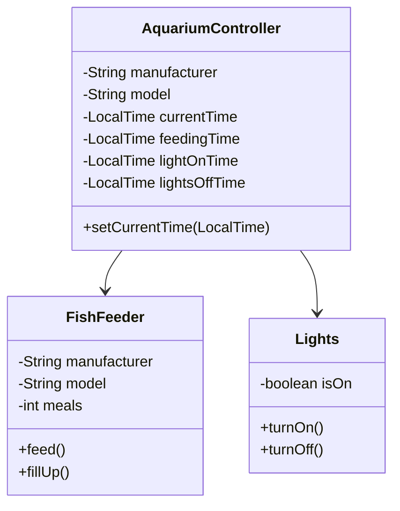

```mermaid
classDiagram
    class AquariumController {
        -String manufacturer
        -String model
        -LocalTime currentTime
        -LocalTime feedingTime
        -LocalTime lightOnTime
        -LocalTime lightsOffTime
        +setCurrentTime(LocalTime)
    }
    class FishFeeder {
        -String manufacturer
        -String model
        -int meals
        +feed()
        +fillUp()
    }
    class Lights {
        -boolean isOn
        +turnOn()
        +turnOff()
    }
    AquariumController --> FishFeeder
    AquariumController --> Lights
```
