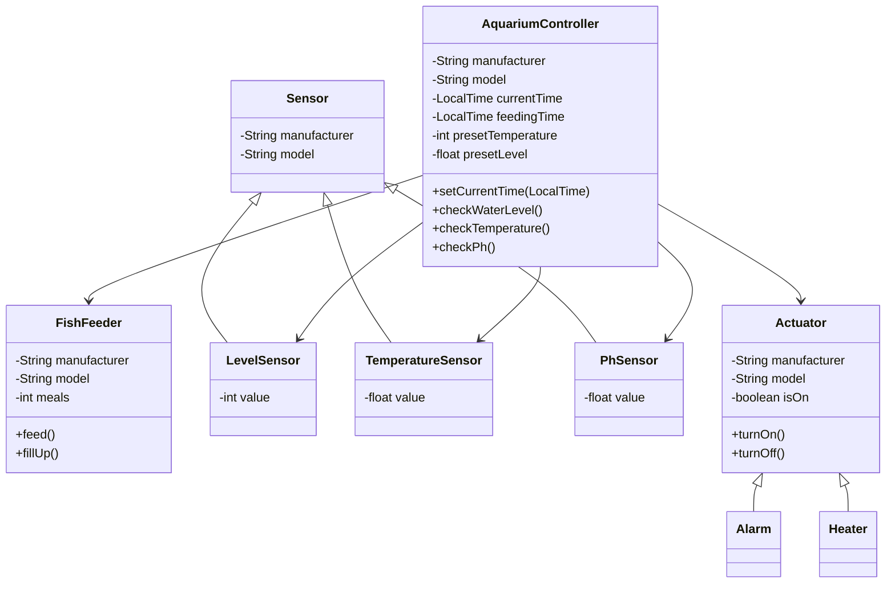

```mermaid
classDiagram
    class AquariumController {
        -String manufacturer
        -String model
        -LocalTime currentTime
        -LocalTime feedingTime
        -int presetTemperature
        -float presetLevel
        +setCurrentTime(LocalTime)
        +checkWaterLevel()
        +checkTemperature()
        +checkPh()
    }
    class FishFeeder {
        -String manufacturer
        -String model
        -int meals
        +feed()
        +fillUp()
    }
    class Sensor {
        -String manufacturer
        -String model
    }
    class LevelSensor {
        -int value
    }
    class TemperatureSensor {
        -float value
    }
    class PhSensor {
        -float value
    }
    class Actuator {
        -String manufacturer
        -String model
        -boolean isOn
        +turnOn()
        +turnOff()
    }
    class Alarm
    class Heater

    Sensor <|-- LevelSensor
    Sensor <|-- TemperatureSensor
    Sensor <|-- PhSensor
    Actuator <|-- Alarm
    Actuator <|-- Heater
    AquariumController --> FishFeeder
    AquariumController --> LevelSensor
    AquariumController --> TemperatureSensor
    AquariumController --> PhSensor
    AquariumController --> Actuator
```
